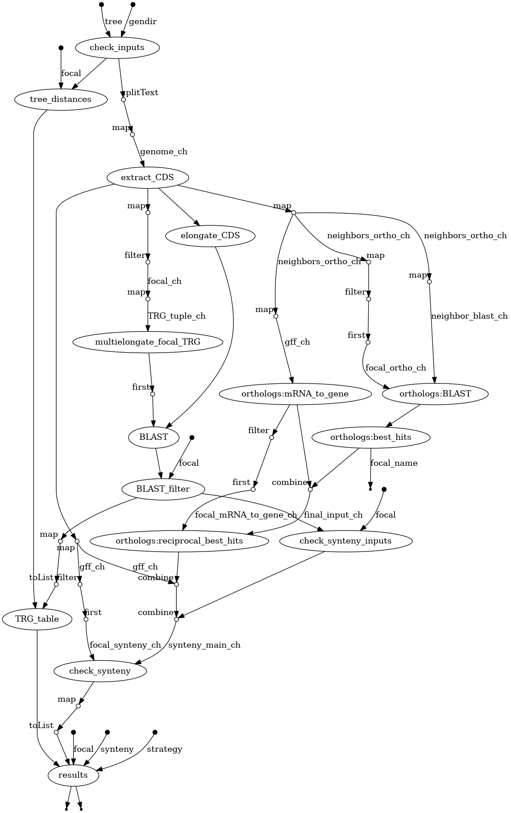

[](https://www.nextflow.io/)

## Introduction

**denovogenes** is a bioinformatics pipeline that finds genes that have emerged *de novo* (e.i. from non-coding DNA).

It uses a genome of interest and its phylogenetic neighbors (genomic FASTA, and GFF3 annotation files).

Starting from genes that are taxonomically restricted (e.i. TRG), it offers severals features to characterize young *de novo* genes, including :
* identifying non-coding homologous regions in the neghbor genomes,
* checking that these regions are in synteny with the potential *de novo* genes.  



<!-- TODO nf-core: Include a figure that guides the user through the major workflow steps. Many nf-core
     workflows use the "tube map" design for that. See https://nf-co.re/docs/contributing/design_guidelines#examples for examples.   -->

1. Check the genome files and the newick tree ([`check_inputs`])
2. Generate a .tsv file with the distances bewteen genomes ([`tree_distances`])
3. Exctract the coding sequences (CDS) from the genomes ([`exctract_CDS`] [`(gffread)`](https://github.com/gpertea/gffread))
4. Elongate the CDS to improve the search for homologs ([`multielongate_focal_TRG`] and [`elongate_CDS`])
5. Blast the taxonomically restricted genes (TRG) against the CDS of the neighbor genomes and against their whole genome ([`BLAST`](https://blast.ncbi.nlm.nih.gov/Blast.cgi))
6. Filter BLAST outputs to keep the best CDS and/or whole-genome hits per query ([`BLAST_filter`])
7. Build a .tsv table with the best hits for every TRG ([`TRG_table`])
8. Turn the appropriate whole-genome best hits into a separated input file per neighbor genome for `check_synteny` ([`check_synteny_inputs`])
9. Identify the orthologs genes bewteen the genome of interest and each of its neighbors ([`orthologs`])
   1. Blastp the CDS of the genome against its neighbor and the other way around with :
      1. BLAST ([`BLAST`](https://blast.ncbi.nlm.nih.gov/Blast.cgi))
      2. DIAMOND ([`DIAMOND_BLAST`](https://github.com/bbuchfink/diamond))
   2. For each genome-of-interest/neighbor-genome pairs, get two list of best hits as .tsv files ([`best_hits`])
   3. Build a mapping .tsv files from mRNA to their parent gene for every genome ([`mRNA_to_gene`])
   4. For each genome-of-interest/neighbor-genome pairs, get their orthologs in a .tsv file ([`reciprocal_best_hits`])
10. Check if TRG/whole-genome homologs are in synteny ([`check_synteny`])
11. Interpret TRG homologs +/- synteny according to the given strategy and add the output to the main .tsv table ([`results`])

## Usage

> **Note**
> If you are new to Nextflow, please refer to [this page](https://www.nextflow.io/docs/latest/getstarted.html) on how
> to set-up Nextflow. Make sure to [test your setup](https://nf-co.re/docs/usage/introduction#how-to-run-a-pipeline)
> with `-profile test` before running the workflow on actual data.

<!-- TODO nf-core: Describe the minimum required steps to execute the pipeline, e.g. how to prepare samplesheets.
     Explain what rows and columns represent. For instance (please edit as appropriate):

First, prepare a samplesheet with your input data that looks as follows:

`samplesheet.csv`:

```csv
sample,fastq_1,fastq_2
CONTROL_REP1,AEG588A1_S1_L002_R1_001.fastq.gz,AEG588A1_S1_L002_R2_001.fastq.gz
```

Each row represents a fastq file (single-end) or a pair of fastq files (paired end).

-->
In order to use the latest Nextflow version, you should use:
```bash
nextflow self-update
```

To test your Nextflow installation you can use : 
```bash
nextflow run hello
```

Now, you can run the pipeline using:

<!-- TODO nf-core: update the following command to include all required parameters for a minimal example -->

```bash
nextflow run nf-core/denovogenes \
   -profile <docker/singularity/.../institute> \
   --input samplesheet.csv \
   --outdir <OUTDIR>
```

> **Warning:**
> Please provide pipeline parameters via the CLI or Nextflow `-params-file` option. Custom config files including those
> provided by the `-c` Nextflow option can be used to provide any configuration _**except for parameters**_;
> see [docs](https://nf-co.re/usage/configuration#custom-configuration-files).

For more details and further functionality, please refer to the [usage documentation](https://nf-co.re/denovogenes/usage) and the [parameter documentation](https://nf-co.re/denovogenes/parameters).

## Pipeline output

To see the results of an example test run with a full size dataset refer to the [results](https://nf-co.re/denovogenes/results) tab on the nf-core website pipeline page.
For more details about the output files and reports, please refer to the
[output documentation](https://nf-co.re/denovogenes/output).

## Credits

nf-core/denovogenes was originally written by Paul Roginski.

We thank the following people for their extensive assistance in the development of this pipeline:

<!-- TODO nf-core: If applicable, make list of people who have also contributed -->

## Contributions and Support

If you would like to contribute to this pipeline, please see the [contributing guidelines](.github/CONTRIBUTING.md).

For further information or help, don't hesitate to get in touch on the [Slack `#denovogenes` channel](https://nfcore.slack.com/channels/denovogenes) (you can join with [this invite](https://nf-co.re/join/slack)).

## Citations

<!-- TODO nf-core: Add citation for pipeline after first release. Uncomment lines below and update Zenodo doi and badge at the top of this file. -->
<!-- If you use  nf-core/denovogenes for your analysis, please cite it using the following doi: [10.5281/zenodo.XXXXXX](https://doi.org/10.5281/zenodo.XXXXXX) -->

<!-- TODO nf-core: Add bibliography of tools and data used in your pipeline -->

An extensive list of references for the tools used by the pipeline can be found in the [`CITATIONS.md`](CITATIONS.md) file.

You can cite the `nf-core` publication as follows:

> **The nf-core framework for community-curated bioinformatics pipelines.**
>
> Philip Ewels, Alexander Peltzer, Sven Fillinger, Harshil Patel, Johannes Alneberg, Andreas Wilm, Maxime Ulysse Garcia, Paolo Di Tommaso & Sven Nahnsen.
>
> _Nat Biotechnol._ 2020 Feb 13. doi: [10.1038/s41587-020-0439-x](https://dx.doi.org/10.1038/s41587-020-0439-x).
